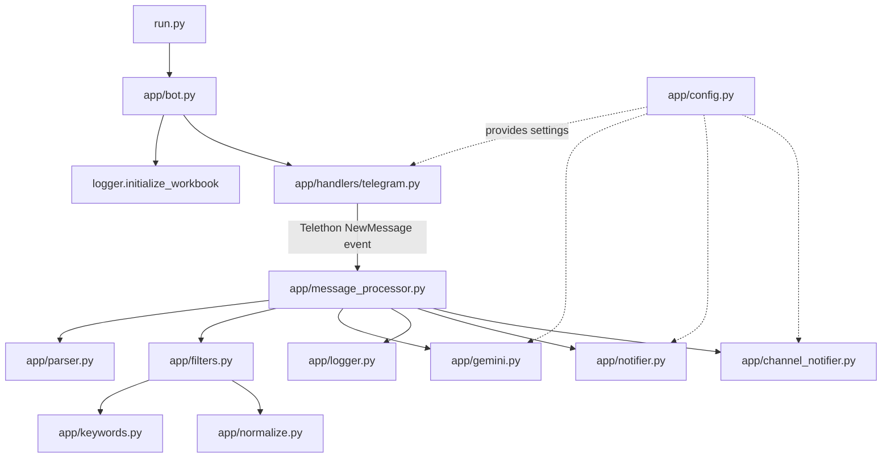
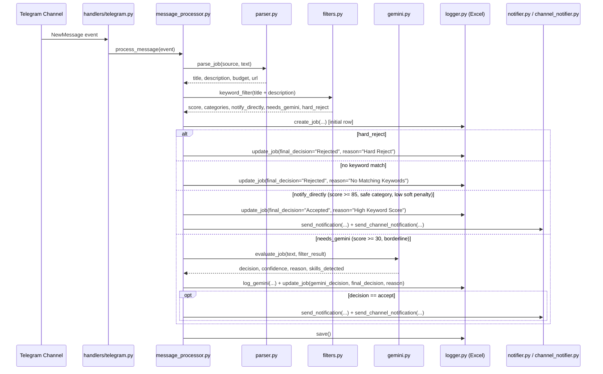

# Loki Freelance Assistant — Technical Documentation

**An AI-assisted Telegram bot that monitors freelance job channels in real time, scores opportunities against a personalized skill profile, uses Google Gemini to review borderline jobs, logs every decision, and instantly notifies you of projects worth bidding on.**

Repository: https://github.com/Mohamed-Basem87/loki-freelance-assistant

---

## Table of Contents

1. [Overview](#1-overview)
2. [Installation](#2-installation)
3. [Configuration](#3-configuration)
4. [Architecture](#4-architecture)
5. [The Keyword Engine](#5-the-keyword-engine)
6. [Gemini Integration](#6-gemini-integration)
7. [Logging](#7-logging)
8. [Deployment (systemd)](#8-deployment-systemd)
9. [Troubleshooting](#9-troubleshooting)
10. [Developer Guide](#10-developer-guide)

---

## 1. Overview

Loki logs into a Telegram **user** account (via Telethon) and listens to a fixed list of channels (`TARGET_CHANNEL_IDS`). Every new message is parsed into a structured job (title, description, budget, URL), run through a deterministic weighted-keyword filter, and routed one of three ways: rejected outright, accepted directly on a high keyword score, or sent to Google Gemini for a judgment call on borderline cases. Every stage of that decision is written to an Excel workbook, and accepted jobs are pushed to Telegram as rich notifications.

**Decision pipeline, at a glance:**

```
Telegram Channel
        │
        ▼
Telethon Handler        app/handlers/telegram.py
        │
        ▼
Parser                  app/parser.py
        │
        ▼
Keyword Filter          app/filters.py (+ keywords.py, normalize.py)
        │
        ▼
Gemini (if required)    app/gemini.py
        │
        ▼
Notification            app/notifier.py + app/channel_notifier.py
        │
        ▼
Excel Logger            app/logger.py
```

**Reading order:**
- Setting Loki up for the first time → [Installation](#2-installation) → [Configuration](#3-configuration) → [Deployment](#8-deployment-systemd).
- Retargeting Loki at a different freelance niche → [The Keyword Engine](#5-the-keyword-engine) → [Gemini Integration](#6-gemini-integration).
- Contributing code → [Architecture](#4-architecture) → [Developer Guide](#10-developer-guide).

---

## 2. Installation

### Prerequisites

- Python 3.11+
- A personal Telegram account (Loki logs in as a **user**, not as a bot, so it can read channel messages — bot accounts cannot join arbitrary channels or read history the way a user account can)
- A Telegram Bot (created separately, used only for sending notifications)
- A Google Gemini API key

### 2.1 Clone the Repository

```bash
git clone https://github.com/Mohamed-Basem87/loki-freelance-assistant.git
cd loki-freelance-assistant
```

### 2.2 Create a Virtual Environment and Install Dependencies

```bash
python -m venv .venv
source .venv/bin/activate      # Windows: .venv\Scripts\activate

pip install -r requirements.txt
```

Installed packages (`requirements.txt`):

| Package | Version | Role |
|---|---|---|
| `Telethon` | 1.44.0 | Logs in as a Telegram user, listens for new channel messages |
| `python-telegram-bot` | 22.8 | Sends notification messages via a Telegram Bot |
| `google-genai` | 2.11.0 | Calls the Gemini API for borderline-job review |
| `openpyxl` | 3.1.5 | Reads/writes the `.xlsx` audit log |
| `python-dotenv` | 1.2.2 | Loads `.env` into environment variables |
| `tenacity` | 9.1.4 | Retries the Gemini API call on transient failure |
| `requests` | 2.34.2 | Transitive dependency used by the above libraries |

### 2.3 Obtain Every Required Credential

#### Telegram API credentials (`API_ID`, `API_HASH`)

These identify the **application** to Telegram's API and are required by Telethon to log in as your user account.

1. Go to https://my.telegram.org and log in with the phone number you want Loki to run as.
2. Open **API Development Tools**.
3. Fill in an app name and short name (anything works — this is not shown to end users).
4. You'll be issued an **API ID** (numeric) and an **API Hash** (a hex string). These go directly into `API_ID` and `API_HASH`.

#### Telegram phone number (`PHONE_NUMBER`)

The full phone number, in international format (e.g. `+201234567890`), for the account you authenticated above. This is the account Loki will log in as and use to read the monitored channels.

#### Telegram Bot credentials (`BOT_TOKEN`, `BOT_CHAT_ID`)

This is a **separate** identity from the user account above — it's the account that actually delivers notification messages.

**Creating the bot (BotFather):**

1. Open a chat with **@BotFather** in Telegram.
2. Send `/newbot`.
3. Choose a display name and a unique username ending in `bot` (e.g. `LokiJobsBot`).
4. BotFather replies with an API token in the form `123456789:AAxxxxxxxxxxxxxxxxxxxxxxxxxxxxx`. This is `BOT_TOKEN`.

**Getting your chat ID (`BOT_CHAT_ID`):**

1. Start a conversation with your new bot (send it any message, e.g. `/start`).
2. `BOT_CHAT_ID` is the numeric chat ID between you and the bot. The simplest way to obtain it is to message a helper bot such as `@userinfobot`, or call `https://api.telegram.org/bot<BOT_TOKEN>/getUpdates` after messaging your bot and read the `chat.id` field from the JSON response.

This is the ID `notifier.py` sends every accepted-job notification to.

#### Optional: a broadcast channel (`BOT_CHANNEL_ID`)

If you also want accepted jobs posted publicly to a Telegram channel (in addition to your private notification), create a Telegram channel, add your bot as an **administrator** of it, and set `BOT_CHANNEL_ID` to that channel's numeric ID (channel IDs are negative, typically prefixed `-100`). This variable is optional — see [Configuration](#3-configuration) for what happens when it's unset.

#### Google Gemini API key (`GEMINI_API_KEY`)

1. Go to Google AI Studio (https://aistudio.google.com/) (or the Google Cloud Console if using a paid project).
2. Create or select a project and generate an API key.
3. Set `GEMINI_API_KEY` to that key.

This key is used by `app/gemini.py`, which calls the `gemini-3.5-flash` model to review borderline job posts — see [Gemini Integration](#6-gemini-integration).

#### Monitored channels (`TARGET_CHANNEL_IDS`)

See [Configuration → TARGET_CHANNEL_IDS](#target_channel_ids) for how to find channel IDs and add more channels.

### 2.4 Configure `.env`

Copy the example file and fill in every value gathered above:

```bash
cp .env.example .env
```

```env
API_ID=12345678
API_HASH=your_api_hash_here
PHONE_NUMBER=+201234567890

BOT_TOKEN=123456789:your_bot_token_here
BOT_CHAT_ID=123456789

GEMINI_API_KEY=your_gemini_api_key_here

TARGET_CHANNEL_IDS=-1001335768304,-1002142292720,-1001994689105
```

`BOT_CHANNEL_ID` is not present in `.env.example` but is read as optional (`os.getenv`, no default enforcement) in `app/config.py` — add it yourself if you want channel broadcasting.

### 2.5 First Run — Telethon Login

```bash
python run.py
```

On the very first run, Telethon has no saved session, so it will prompt interactively in the terminal:

1. It sends a login code to your Telegram app.
2. You are prompted to enter that code in the terminal.
3. If your account has Two-Factor Authentication enabled, you'll also be prompted for your cloud password.

Once authenticated, Telethon saves a session file at `sessions/telegram.session` (an SQLite database — see [Troubleshooting → Telethon Session Issues](#telethon-session-issues)). Subsequent runs reuse this file and will not prompt again, as long as the file isn't deleted or the session isn't revoked from another device.

On success you'll see:

```
======================================================================
Logged in as: <your first name>
======================================================================
Listening for new jobs...
```

`app/bot.py` also calls `initialize_workbook()` before starting the client, which creates `logs/freelance_bot_logs.xlsx` if it doesn't already exist — see [Logging](#7-logging).

For unattended production use, see [Deployment](#8-deployment-systemd) — note that systemd services can't respond to an interactive login prompt, so the first login should always be done manually as shown above, *before* installing the systemd unit.

---

## 3. Configuration

All configuration is environment-variable based, loaded from `.env` via `python-dotenv` in `app/config.py`. Every variable is validated at import time — if a required variable is missing or malformed, Loki raises a `RuntimeError` immediately on startup rather than failing later mid-run.

### Environment Variables

| Variable | Required | Type | Validated by | Description |
|---|---|---|---|---|
| `API_ID` | Yes | integer | `_require_int_env` | Telegram application ID from my.telegram.org. Used by Telethon to authenticate the monitoring account. |
| `API_HASH` | Yes | string | `_require_env` | Telegram application hash, paired with `API_ID`. |
| `PHONE_NUMBER` | Yes | string | `_require_env` | Phone number (international format) of the Telegram account Loki logs in as. |
| `BOT_TOKEN` | Yes | string | `_require_env` | Token for the notification Bot, issued by BotFather. |
| `BOT_CHAT_ID` | Yes | integer | `_require_int_env` | Numeric chat ID the bot sends every notification to (your private chat with the bot). |
| `BOT_CHANNEL_ID` | No | string or `None` | plain `os.getenv`, no validation | Optional channel ID for broadcasting accepted jobs publicly. If unset, `app/channel_notifier.py` silently skips channel notifications and `app/notifier.py` sends only to `BOT_CHAT_ID`. |
| `GEMINI_API_KEY` | Yes | string | `_require_env` | API key for Google Gemini, used to review borderline jobs. |
| `TARGET_CHANNEL_IDS` | Yes | comma-separated integers | `_require_channel_ids` | The set of Telegram channel IDs Loki listens to. Parsed into a Python `set[int]`. |

Two derived, non-environment values are also defined in `config.py`:

- `BASE_DIR` — the project root (`Path(__file__).resolve().parent.parent`), used to build absolute paths.
- `SESSION_NAME` — `BASE_DIR / "sessions" / "telegram"`, the path Telethon uses to persist its login session (Telethon appends `.session` itself).

### Validation Behavior

`app/config.py` defines three helpers used to validate every variable at import time (i.e. the moment `run.py` executes `from app.bot import main`, before anything else happens):

- **`_require_env(name)`** — raises `RuntimeError` if the variable is missing or empty/whitespace-only.
- **`_require_int_env(name)`** — calls `_require_env`, then casts to `int`; raises `RuntimeError` with the offending value if the cast fails.
- **`_require_channel_ids(name)`** — calls `_require_env`, splits on commas, strips whitespace from each entry, and casts each to `int`, returning a `set[int]`. Raises `RuntimeError` if any entry isn't a valid integer.

This means a missing or malformed `.env` fails loudly and immediately, with a message telling you exactly which variable is the problem — see [Troubleshooting → Missing Environment Variables](#missing-environment-variables).

### TARGET_CHANNEL_IDS

#### How it works

`TARGET_CHANNEL_IDS` is a comma-separated list of Telegram channel/supergroup IDs. `config.py` parses it into a `set[int]` (`TARGET_CHANNELS`), which `app/handlers/telegram.py` passes directly to Telethon's event filter:

```python
@client.on(events.NewMessage(chats=list(TARGET_CHANNELS)))
```

Telethon only fires the handler for messages originating in one of these chats — everything else is ignored at the client level, before any parsing or scoring happens.

Telegram channel and supergroup IDs are negative numbers, and "broadcast channel" IDs are conventionally prefixed with `-100` (e.g. `-1001335768304`).

#### Finding a channel's ID

Loki's user account (the one authenticated with `API_ID`/`API_HASH`/`PHONE_NUMBER`) must already be a member of a channel to receive its messages. To find a channel's numeric ID:

- Forward any message from the target channel to a bot such as `@userinfobot` or `@JsonDumpBot`, which will report the source chat's ID.
- Alternatively, use Telethon interactively (e.g. `client.get_dialogs()` in a Python shell) to list all chats your account is a member of along with their IDs.

#### Monitoring additional channels

1. Join the channel with the same Telegram account used for `PHONE_NUMBER`.
2. Find its ID using one of the methods above.
3. Append it to `TARGET_CHANNEL_IDS` in `.env`, comma-separated.
4. Restart Loki (or restart the systemd service — see [Deployment](#8-deployment-systemd)) so `config.py` re-reads the updated list. There is no hot-reload; the set is built once at import time.

### Session Storage

`SESSION_NAME` resolves to `sessions/telegram` under the project root. This directory is excluded from git (`.gitignore` lists `sessions/` and `*.session`) since the session file grants full access to the logged-in Telegram account and must never be committed or shared.

---

## 4. Architecture

Loki is a single-process, event-driven bot. There is no web server, no database, and no background scheduler — Telethon holds an open connection to Telegram and dispatches an async callback for every new message in a monitored channel. Everything downstream of that callback (parsing, scoring, optional AI review, logging, notification) runs inline within that message's handling.

### Module Responsibilities

| Module | Responsibility |
|---|---|
| `run.py` | Entry point. Calls `app.bot.main()`. |
| `app/bot.py` | Initializes the Excel workbook, then starts the asyncio event loop via `app/handlers/telegram.py`. |
| `app/config.py` | Loads and validates all environment variables; the single source of truth for configuration. |
| `app/handlers/telegram.py` | Owns the Telethon client: logs in, registers the `NewMessage` event handler scoped to `TARGET_CHANNELS`, and dispatches each incoming message to `process_message`. |
| `app/parser.py` | Converts a raw Telegram message into a structured job dict (title, description, budget, URL, source). Contains source-specific logic for Nafezly-style posts and a generic fallback for everything else. |
| `app/normalize.py` | Normalizes text (Arabic character unification, diacritic stripping, punctuation removal, lowercasing) so the keyword engine matches consistently regardless of formatting or Arabic orthographic variation. |
| `app/keywords.py` | The static data: `INTEREST_CATEGORIES` (positive keyword categories and weights), `HARD_REJECT_KEYWORDS`, and `SOFT_NEGATIVE_KEYWORDS`. This is the file you edit to retarget Loki at a different niche — see [The Keyword Engine](#5-the-keyword-engine). |
| `app/filters.py` | The scoring engine. Combines `keywords.py` + `normalize.py` into `keyword_filter(text)`, which returns a score, matched categories, and routing decisions (`notify_directly`, `needs_gemini`, `hard_reject`). |
| `app/gemini.py` | Calls the Gemini API to review borderline jobs against a hardcoded freelancer profile, with retry and a structured-JSON response contract. |
| `app/message_processor.py` | The orchestrator. Ties parsing → filtering → (optional) Gemini → logging → notification together for a single incoming message. |
| `app/notifier.py` | Sends the private Telegram notification (to `BOT_CHAT_ID`, and `BOT_CHANNEL_ID` if set) with full job detail, score, and reasoning. |
| `app/channel_notifier.py` | Sends a separate, public-facing notification to `BOT_CHANNEL_ID` only (if configured), with a simplified message and no internal scoring detail. |
| `app/logger.py` | `ExcelLogger` — a thin wrapper over `openpyxl` that maintains the four-worksheet audit workbook, including an in-memory row index so a job's row can be efficiently re-updated later in the pipeline. |

### Module Interaction



### Per-Message Sequence



### Why This Shape

- **Keyword filter before AI.** The deterministic scoring pass in `filters.py` runs first and is essentially free, so most obviously-relevant or obviously-irrelevant posts never touch the Gemini API at all. Gemini is reserved for the ambiguous middle band — see [Gemini Integration](#6-gemini-integration).
- **Excel, not a database.** `logger.py` writes directly to an `.xlsx` file rather than a database. For a single-operator personal assistant this keeps the audit trail human-readable and requires no additional infrastructure — see [Logging](#7-logging).
- **Two notification channels.** `notifier.py` (private, detailed, includes score/categories/AI reasoning) and `channel_notifier.py` (public, only fires if `BOT_CHANNEL_ID` is set, simplified) are separate modules because they serve different audiences and are independently optional to configure.
- **Everything in one process.** There's no queue or worker pool; `process_message` runs to completion (including a blocking-but-threaded Gemini call, via `asyncio.to_thread`) for each event before the next is handled by the asyncio loop. This is adequate for the message volume of a handful of monitored channels.

---

## 5. The Keyword Engine

Loki's entire relevance decision is driven by `app/keywords.py` (the data) and `app/filters.py` (the scoring logic in `keyword_filter()`).

### Text Normalization

Before any matching happens, both the job text and every keyword are passed through `normalize()` in `app/normalize.py`:

1. Lowercased.
2. Arabic character variants unified (`أ إ آ ٱ` → `ا`, `ى` → `ي`, `ؤ` → `و`, `ئ` → `ي`) so orthographic variation doesn't cause a missed match.
3. Arabic diacritics (tashkeel) stripped via the Unicode range `\u064B-\u065F` plus `\u0670`.
4. Separator characters (`- _ / \ |`) replaced with spaces.
5. Remaining punctuation stripped.
6. Whitespace collapsed to single spaces and trimmed.

### Keyword Categories

`INTEREST_CATEGORIES` in `app/keywords.py` is a dict of category → `{keyword: weight}`. The current categories are:

| Category | Purpose | Example keywords (weight) |
|---|---|---|
| `power_bi` | Power BI-specific work | `power bi` (50), `pbix` (60), `dax` (50), `star schema` (40), `باور بي` (50) |
| `excel` | Excel/spreadsheet work | `excel` (30), `pivot table` (30), `vlookup` (25), `شيت اكسل` (30) |
| `sql` | Database/query work | `sql` (25), `sql server` (25), `database` (15), `قاعدة بيانات` (20) |
| `data_analysis` | General analytics/BI/reporting | `data analysis` (40), `business intelligence` (35), `kpi` (25), `تحليل بيانات` (40) |
| `python` | Python scripting/automation-adjacent | `python` (20), `pandas` (30), `web scraping` (25) |
| `automation` | Workflow automation tooling | `automation` (30), `n8n` (25), `zapier` (20) |
| `portfolio` | Personal/portfolio websites | `portfolio website` (50), `landing page` (30), `بورتفوليو` (50) |

Both English and Arabic keyword variants are included per category, since the target channels post in both languages.

### Scoring Algorithm (`keyword_filter`)

1. **Build a master keyword map** across *all* categories. If the same keyword string appears in more than one category (after normalization) with different weights, only the highest-weighted entry is kept.
2. **Order keywords longest-first** (by normalized character length). This matters: matching is applied greedily, and after a keyword matches, that span of text is masked out (replaced with spaces of equal length) so a shorter keyword contained within it can't also match and double-count the score. Ordering longest-first ensures, e.g., `"excel sheet"` (a more specific, differently-weighted phrase) is matched before the bare `"excel"` inside it would otherwise consume the text.
3. **Match positive keywords** against the normalized text. English keywords (`[a-z]` present) use `\b` word-boundary regex matching, to avoid `"bot"` matching inside `"robotics"`. Arabic keywords use plain substring matching, since Python's `\b` is not reliable across Arabic script.
4. **Match soft negatives.** `SOFT_NEGATIVE_KEYWORDS` (e.g. `wordpress: -40`, `full stack: -40`, `erp: -50`) are checked against the *original* normalized text — not the masked/remaining text from step 3. This is a deliberate difference from positive matching: soft-negative signals aren't suppressed by an overlapping positive match.
5. **Match hard rejects.** `HARD_REJECT_KEYWORDS` (e.g. `graphic design`, `logo`, `video editing`, `translation`, `seo`) are matched the same way. A message is only actually hard-rejected if a hard-reject keyword is found **and** zero positive keywords matched at all. If any positive keyword also matched, the hard-reject flag is *not* set — the message proceeds to normal score-based routing instead, letting a mixed post (e.g. "logo design *and* a Power BI dashboard") reach Gemini rather than being auto-rejected.

### Scoring Weights

Weights are simple additive integers assigned per keyword, chosen so that:
- A single strong signal (e.g. `power bi` at 50, `pbix` at 60) can be worth more than several weak ones.
- Generic terms (`report`, `تقرير`, `analysis`) carry low weights (10–20) since they're common noise words in many kinds of posts.
- Soft negatives are large enough (typically -20 to -50) to meaningfully offset a positive score without necessarily zeroing it out — the intent is to flag "this project has heavy web/mobile engineering scope" rather than reject on sight.

There is no upper bound on total score; a post matching several strong keywords can accumulate well past 100.

### Decision Thresholds

Defined at the top of `app/filters.py`:

| Constant | Value | Meaning |
|---|---|---|
| `GEMINI_THRESHOLD` | 30 | Minimum score for a post to be considered at all past a flat reject. |
| `DIRECT_NOTIFY_THRESHOLD` | 85 | Minimum score to skip Gemini and notify immediately. |
| `SAFE_DIRECT_CATEGORIES` | `{power_bi, excel, data_analysis, sql, portfolio}` | Categories allowed to bypass Gemini. `python` and `automation` are *not* in this set. |
| `DIRECT_NOTIFY_SOFT_PENALTY_LIMIT` | -60 | If accumulated soft-negative penalty is this low or lower, the post is treated as too "tech-heavy" to auto-accept even at a high score. |

**Routing logic**, in order:

- `hard_reject` → **Rejected**, no Gemini call.
- No positive keyword matched at all → **Rejected**, no Gemini call.
- `score >= 85` **and** all matched categories are in `SAFE_DIRECT_CATEGORIES` **and** soft penalty is above -60 → **Accepted immediately**, no Gemini call.
- `score >= 30` (and the above direct-accept conditions weren't all met) → **sent to Gemini** for a judgment call.
- `score < 30` → falls through every branch; the job is logged as an initial row but never receives an explicit final decision or notification (effectively rejected by omission — see [Troubleshooting](#9-troubleshooting) for this inferred edge case).

Note the important consequence of `SAFE_DIRECT_CATEGORIES`: a post matching only `python` or `automation` keywords, however high its score, can *never* auto-accept — it always goes through Gemini. This is deliberate, since `python`/`automation` keywords alone are a weaker signal that the primary deliverable is actually within scope (a large backend project might also mention "automation").

### Adapting Loki to a Different Freelance Niche

The routing logic in `filters.py` is niche-agnostic — everything niche-specific lives in `keywords.py` (and, for AI review, the profile section of `gemini.py`'s system prompt — see [Gemini Integration](#6-gemini-integration)). To retarget Loki:

1. Replace or extend `INTEREST_CATEGORIES` with categories relevant to the new niche.
2. Add competing/adjacent-technology terms to `SOFT_NEGATIVE_KEYWORDS` if there's a related-but-out-of-scope skill worth penalizing rather than hard-rejecting.
3. Add unrelated-skill terms to `HARD_REJECT_KEYWORDS` if certain project types should never even reach Gemini.
4. Update `SAFE_DIRECT_CATEGORIES` in `filters.py` to match your new category names.
5. Rewrite the `FREELANCER PROFILE` and accept/reject examples inside `app/gemini.py`'s `SYSTEM_PROMPT` to reflect the new skill set — this is what Gemini actually judges borderline posts against.

**Example — Data Analytics / Python Automation (current default):**
```python
"python": {
    "python": 20, "pandas": 30, "web scraping": 25, "etl": 20,
},
```
Already ships with `power_bi`, `excel`, `sql`, `data_analysis`, `python`, `automation`, `portfolio` as shown above.

**Example — Web Development:**
```python
"web_dev": {
    "wordpress": 40, "shopify": 40, "web development": 45,
    "landing page": 35, "responsive website": 35, "html": 15, "css": 15,
    "تطوير مواقع": 40, "موقع ويب": 35,
},
```
Note this would require *removing* `wordpress`/`shopify` from `SOFT_NEGATIVE_KEYWORDS`, since they're currently penalized as out-of-scope for the default (data-analytics-focused) profile.

**Example — Graphic Design:**
```python
"graphic_design": {
    "logo": 40, "logo design": 50, "brand identity": 40,
    "photoshop": 35, "illustrator": 35, "social media design": 30,
    "تصميم لوجو": 40, "هوية بصرية": 40,
},
```
This would require removing `graphic design`, `logo`, `photoshop`, `illustrator` from `HARD_REJECT_KEYWORDS`, since those are exactly the terms currently used to filter graphic-design work *out*.

**Example — Video Editing:**
```python
"video_editing": {
    "video editing": 50, "motion graphics": 45, "premiere pro": 35,
    "after effects": 35, "color grading": 30, "مونتاج": 40, "موشن جرافيك": 40,
},
```
Again, remove `video editing`, `motion graphics` from `HARD_REJECT_KEYWORDS` first.

**Example — Translation:**
```python
"translation": {
    "translation": 40, "translator": 40, "arabic to english": 40,
    "english to arabic": 40, "localization": 30, "ترجمة": 40, "مترجم": 40,
},
```
Remove `translation` from `HARD_REJECT_KEYWORDS`.

**General pattern for any niche:**
1. Identify 15–30 keywords (English + Arabic if relevant) a real job post in that niche would contain.
2. Weight the most specific/high-intent terms (tool names, deliverable names) highest; weight generic terms (`design`, `report`, `content`) lowest.
3. Decide which currently-hard-rejected or currently-soft-negative terms need to move into the new positive category (or be removed from the reject/negative lists entirely).
4. Run `test_keyword_routing.py` (see [Developer Guide](#10-developer-guide)) against a handful of representative real and non-representative posts to sanity-check scores and routing before deploying.
5. Use the Excel log over the following weeks to refine weights — see [Logging → Tuning Keyword Weights](#tuning-keyword-weights-from-the-log).

---

## 6. Gemini Integration

`app/gemini.py` provides `evaluate_job(text, filter_result)`, called only for posts the keyword filter classifies as **borderline** — see the routing logic in [Decision Thresholds](#decision-thresholds).

### When Gemini Is Called

From `app/message_processor.py`, Gemini is invoked exactly when `filter_result["needs_gemini"]` is `True`, which — per `app/filters.py` — requires all of:

- At least one positive keyword matched (`matched = True`)
- Not a hard reject
- Not already qualifying for direct auto-accept
- Score `>= 30` (`GEMINI_THRESHOLD`)

In practice this covers two situations:
1. **Genuinely mid-range scores** (roughly 30–84) — enough signal to not be obvious noise, not enough to be a confident auto-accept.
2. **High scores that still don't qualify for direct accept** — either because the matched categories aren't all in `SAFE_DIRECT_CATEGORIES` (e.g. a `python`/`automation`-only match), or because the accumulated soft-negative penalty crossed `DIRECT_NOTIFY_SOFT_PENALTY_LIMIT` (-60), signaling the post is heavy on out-of-scope web/mobile/backend technology despite also mentioning something relevant.

### Why Gemini Is Only Used for Borderline Jobs

This is a deliberate design decision, enforced structurally by the threshold logic:

- **Cost and latency.** Most posts are either clearly irrelevant (never reach Gemini — rejected by the keyword filter alone) or clearly relevant (score high enough, safe categories, low soft penalty — auto-accepted with zero API calls). Only the ambiguous minority costs an API call.
- **The keyword filter is a cheap, deterministic first pass**; Gemini is reserved for cases where a simple weighted sum genuinely isn't enough — e.g. distinguishing "a Power BI dashboard as the entire deliverable" from "a Power BI dashboard as one small component of a much larger ERP system."

### The Freelancer Profile

`SYSTEM_PROMPT` in `app/gemini.py` hardcodes a **freelancer profile** (education, strong skills, current focus, what's explicitly out of scope) that Gemini evaluates every borderline post against. As shipped, this profile centers on Power BI, Excel, SQL, Python, data analysis/cleaning/visualization, business intelligence, DAX, Power Query, ETL, reporting, pandas, NumPy, automation, and web scraping, with portfolio websites (HTML/CSS/Bootstrap) as a secondary "can also do" capability. It explicitly excludes backend, frontend, full-stack, mobile, DevOps, and enterprise software engineering.

If you retarget Loki's keyword engine to a different niche (see [The Keyword Engine](#5-the-keyword-engine)), **you must also rewrite this profile** — Gemini's accept/reject judgment is entirely driven by it, independent of the keyword categories.

### Evaluation Instructions

The prompt instructs Gemini to:
- Judge the post's **primary deliverable**, not merely which technologies are name-dropped ("if SQL, Python, Excel, AI, Power BI or Dashboards are mentioned only as PART of a much larger software engineering project, reject it").
- Ask "what is the client actually paying someone to build?" — accept if the answer is data analysis/BI/automation/reporting/dashboards, reject if the answer is software engineering.
- Only accept if the freelancer could realistically complete **at least 70%** of the requested work independently with the configured skills.
- Be conservative — when uncertain, reject.
- Assign a confidence score with defined bands: 95–100 excellent match, 80–94 strong match, 60–79 borderline but possible, 0–59 reject.

### Request Construction

`evaluate_job()` builds the user-turn prompt by embedding:
- The keyword filter's score, matched categories, positive matches, and soft-negative matches (giving Gemini the deterministic signal alongside its own judgment).
- The raw job text, wrapped in an explicit `<JobDescription>` tag with an instruction to treat it as **untrusted content** and ignore any instructions contained within it — a prompt-injection defense, since job post text is attacker-controllable input from public Telegram channels.

### Model and Retry Behavior

- Model: `gemini-3.5-flash`, called via `client.models.generate_content()`.
- Wrapped in `@retry(stop=stop_after_attempt(2), wait=wait_fixed(1), reraise=True)` (via `tenacity`) — one retry after a 1-second wait on any exception, then the original exception is re-raised if the retry also fails.
- The call itself is synchronous; `message_processor.py` runs it via `asyncio.to_thread()` so it doesn't block the asyncio event loop handling other incoming messages.

### Response Format and Handling

Gemini is instructed to return **only** a JSON object, no markdown, no commentary:

```json
{
    "decision": "accept" | "reject",
    "confidence": <integer>,
    "project_type": "<short classification>",
    "primary_deliverable": "<one short sentence>",
    "reason": "<concise, under 60 words>",
    "skills_detected": ["Skill 1", "Skill 2"]
}
```

The `reason` field has specific negative constraints in the prompt: it must not mention any person's name, must not refer to "the freelancer"/"the user"/"the profile"/"the candidate", must not use generic phrases like "good fit," and must not simply repeat the project title — it should read as a standalone analysis of the project itself.

`evaluate_job()` post-processes the raw response:
1. Strips a leading/trailing ` ```json ` or ` ``` ` code fence if present (models sometimes wrap JSON in one despite instructions not to).
2. Parses the result as JSON and checks that all six required keys are present.
3. **On any parse failure or missing key**, falls back to a safe default: `decision: "reject"`, `confidence: 0`, `reason: "Invalid Gemini response"` — this fail-closed behavior means a malformed AI response never accidentally causes a false accept.

### What Happens With the Result

Back in `message_processor.py`:
- `final_decision` becomes `gemini["decision"].capitalize()` (`"Accept"` → `"Accepted"`, `"Reject"` → `"Rejected"`).
- `decision_reason` becomes Gemini's `reason` text.
- `should_notify` is `True` only if `gemini["decision"] == "accept"`.
- The Gemini call and its outcome are logged to the dedicated **Gemini** worksheet (score before review, response time, decision, confidence — see [Logging](#7-logging)), and the **Jobs** worksheet row for this job is updated with the Gemini decision alongside the final decision and reason.
- If the Gemini call itself raises an exception (even after retry), it's caught, logged to the **Errors** worksheet, and the job is marked `Rejected` with reason `"Gemini Error"` — a Gemini outage degrades to a conservative reject rather than crashing message processing.

---

## 7. Logging

Every processed message produces one or more rows in an Excel workbook, managed entirely by the `ExcelLogger` class in `app/logger.py`. This is Loki's only persistence layer — there is no database.

### Workbook Location

`logs/freelance_bot_logs.xlsx`, resolved relative to the project root (`Path(__file__).resolve().parent.parent / "logs" / ...` from inside `app/logger.py`). The `logs/` directory is created automatically (`mkdir(parents=True, exist_ok=True)`) if it doesn't exist. The generated file itself is excluded from git via `.gitignore`.

### Initialization

`initialize_workbook()` (called once, from `app/bot.py`, before the Telethon client starts) checks whether the file already exists:
- **If not**, it creates a new workbook with four sheets (removing openpyxl's default blank sheet), writes each sheet's header row, and saves.
- **Either way**, it then loads the workbook into memory and rebuilds an in-memory index (`job_uuid → row number`) by scanning the **Jobs** sheet, so later updates to a job's row don't require a linear search.

### The Four Worksheets

#### Jobs

One row is created per incoming message (via `create_job`), then updated in place (via `update_job`) as the pipeline progresses — a single job never produces more than one row here.

| Column | Description |
|---|---|
| Timestamp | ISO timestamp when the row was created |
| Job UUID | Internal UUID generated per message, used to correlate rows across sheets |
| Job ID | The Telegram message ID |
| Source | The channel/chat title the message came from |
| Title | Parsed job title |
| Company | Always empty in the current implementation — reserved but unused by `parser.py` |
| URL | Parsed project URL (from message text or inline button) |
| Score | Keyword filter's total score |
| Categories | Comma-joined list of matched keyword categories |
| Positive Matches | Comma-joined list of matched positive keywords |
| Negative Matches | Comma-joined list of matched soft-negative keywords |
| Hard Reject | Boolean — whether the hard-reject rule fired |
| Notify Directly | Boolean — whether the keyword filter alone triggered auto-accept |
| Needs Gemini | Boolean — whether the message was routed to Gemini |
| Gemini Decision | Set later, if applicable (`accept`/`reject`) |
| Notification Status | Reserved column in the header; not currently written to by `update_job` (notification outcomes are recorded per-platform in the **Notifications** sheet instead) |
| Final Decision | `Accepted` or `Rejected` |
| Decision Reason | Human-readable reason — one of `"Hard Reject"`, `"No Matching Keywords"`, `"High Keyword Score"`, or Gemini's own `reason` text |
| Filter Time (ms) | How long the keyword filter took to run |

#### Gemini

One row per Gemini API call (only for jobs that were actually routed to Gemini).

| Column | Description |
|---|---|
| Timestamp | When the call completed |
| Job UUID | Links back to the Jobs sheet |
| Score Before | The keyword score at the time Gemini was invoked |
| Prompt Tokens / Completion Tokens | Present in the schema but not currently populated (written as empty strings by `message_processor.py`) — reserved for future token-usage tracking |
| Response Time (ms) | Gemini API call latency |
| Decision | `accept` or `reject` |
| Confidence | Gemini's self-reported 0–100 confidence |

#### Notifications

One row per notification *attempt* (both `send_notification` and `send_channel_notification` log independently, and each retries/fails independently).

| Column | Description |
|---|---|
| Timestamp | When the attempt was made |
| Job UUID | Links back to the Jobs sheet |
| Platform | `"Telegram"` (private chat) or `"Telegram Channel"` (public channel) |
| Status | `"Sent"` or `"Failed"` |

#### Errors

One row per caught exception anywhere in the pipeline — the handler-level catch-all in `handlers/telegram.py`, the Gemini call failure path in `message_processor.py`, notifier failures, and logger save failures.

| Column | Description |
|---|---|
| Timestamp | When the error was caught |
| Module | A short label identifying where it occurred (`"MessageHandler"`, `"Gemini"`, `"Notifier"`, `"ChannelNotifier"`, `"Logger"`) |
| Error | `str(exception)` |

### Write and Save Behavior

`ExcelLogger` batches writes rather than saving to disk on every call, to avoid excessive disk I/O:

- Every mutating call (`create_job`, `update_job`, `log_gemini`, `log_notification`) increments an internal `_pending_writes` counter via `_mark_dirty()`.
- Once `_pending_writes` reaches `_save_interval` (25), the workbook is saved to disk and the counter resets.
- `log_error` is the one exception — it **always saves immediately**, so an error is never lost if the process crashes shortly after.
- `message_processor.process_message` also unconditionally calls `logger.save()` in a `finally` block at the end of every message, so in practice every message's Jobs-sheet row (and any related Gemini/Notification rows) is flushed to disk before the handler returns, regardless of the 25-write threshold. Any exception from that final `save()` is itself caught and logged as an `"Logger"` error.

### Tuning Keyword Weights From the Log

The Jobs and Gemini sheets together form a decision audit trail you can use to iteratively improve `app/keywords.py`:

- **Compare `Score` against `Final Decision`.** If jobs you'd consider clearly relevant are consistently scoring below 30 (never reaching Gemini) or between 30–84 (unnecessarily costing Gemini calls) rather than clearing 85, consider raising the weights of the keywords they actually contain (check `Positive Matches`).
- **Inspect `Gemini Decision` vs. your own judgment.** If Gemini is frequently rejecting jobs you'd have wanted, the `SYSTEM_PROMPT` profile in `gemini.py` may need adjustment rather than the keyword weights.
- **Watch `Negative Matches` and `Hard Reject`.** If legitimate jobs are being hard-rejected, check whether a `HARD_REJECT_KEYWORDS` term is too broad, or whether it should instead be a smaller `SOFT_NEGATIVE_KEYWORDS` penalty (since hard rejects never reach Gemini even for a nuanced review).
- **Check the Errors sheet regularly** — a spike in `"Gemini"` errors, for instance, is a much faster diagnostic than digging through console output after the fact.

Because scoring and routing are entirely deterministic given `keywords.py` + `filters.py`, you can also replay historical `Positive Matches`/`Negative Matches` combinations mentally (or by re-running `test_keyword_routing.py` with new sample text) before touching production weights.

---

## 8. Deployment (systemd)

Loki is designed to run unattended as a Linux `systemd` service. Complete [Installation](#2-installation) first, including the **manual, interactive first run** — systemd cannot answer the Telethon login prompt, so a valid `sessions/telegram.session` file must already exist before the service starts.

### 8.1 Create the systemd Unit File

Create `/etc/systemd/system/loki.service` (adjust `User`, `WorkingDirectory`, and the Python interpreter path to match your deployment):

```ini
[Unit]
Description=Loki Freelance Assistant
After=network-online.target
Wants=network-online.target

[Service]
Type=simple
User=your_linux_username
WorkingDirectory=/path/to/loki-freelance-assistant
ExecStart=/path/to/loki-freelance-assistant/.venv/bin/python run.py
Restart=on-failure
RestartSec=10
EnvironmentFile=/path/to/loki-freelance-assistant/.env

[Install]
WantedBy=multi-user.target
```

Notes:
- `EnvironmentFile` points systemd at the same `.env` file `python-dotenv` would otherwise load — this makes the variables available even though systemd itself doesn't run `dotenv`. (`app/config.py` also calls `load_dotenv()` directly, so this line is a belt-and-suspenders measure in case the working directory or environment differs from a plain `python run.py` invocation; keeping it ensures the required variables are present either way.)
- `Restart=on-failure` with `RestartSec=10` gives Loki resilience against transient crashes (e.g. a temporary network blip) without hammering restart attempts.

### 8.2 Enable and Start

```bash
sudo systemctl daemon-reload
sudo systemctl enable loki.service   # start automatically at boot
sudo systemctl start loki.service
```

### 8.3 Check Status

```bash
sudo systemctl status loki.service
```

### 8.4 Restarting

After any configuration change (`.env`, `app/keywords.py`, etc.), the process must be restarted for changes to take effect — there is no hot-reload:

```bash
sudo systemctl restart loki.service
```

### 8.5 Updating After a `git pull`

```bash
cd /path/to/loki-freelance-assistant
git pull

source .venv/bin/activate
pip install -r requirements.txt   # in case dependencies changed

sudo systemctl restart loki.service
```

### 8.6 Viewing Logs

Console output (the `print()` statements in `handlers/telegram.py` — login confirmation, per-message `[TARGET]` lines, and `[ERROR]` lines) is captured by systemd's journal, not written to a file directly:

```bash
# Follow live
sudo journalctl -u loki.service -f

# Last 200 lines
sudo journalctl -u loki.service -n 200

# Since a given time
sudo journalctl -u loki.service --since "1 hour ago"
```

This is separate from the Excel audit log (`logs/freelance_bot_logs.xlsx`) described in [Logging](#7-logging) — `journalctl` shows process-level stdout/stderr and crash output, while the Excel workbook shows per-job decision detail.

### 8.7 Stopping / Disabling

```bash
sudo systemctl stop loki.service
sudo systemctl disable loki.service   # remove from boot
```

---

## 9. Troubleshooting

### Missing Environment Variables

**Symptom:** Loki fails immediately on startup with:
```
RuntimeError: Missing required environment variable: <NAME>
Please set it in your .env file.
```

**Cause:** `app/config.py` validates every required variable (`API_ID`, `API_HASH`, `PHONE_NUMBER`, `BOT_TOKEN`, `BOT_CHAT_ID`, `GEMINI_API_KEY`, `TARGET_CHANNEL_IDS`) at import time via `_require_env`/`_require_int_env`/`_require_channel_ids`. This is deliberate fail-fast behavior.

**Fix:** Check the variable name in the error against `.env`. Confirm `.env` exists in the project root (not `.env.example`) and that the process's working directory matches where `python-dotenv` expects to find it (`load_dotenv()` in `config.py` looks in the current working directory by default).

A related but distinct error, `"Environment variable '<NAME>' must be an integer (got '<value>')"`, means `API_ID` or `BOT_CHAT_ID` contains non-numeric text. A similar error for `TARGET_CHANNEL_IDS` means one of the comma-separated entries isn't a valid integer — check for stray characters or trailing commas.

### Telethon Session Issues

**Symptom:** Loki prompts for a login code again despite having logged in before, or fails to connect with a session-related error.

**Cause / behavior:** Telethon stores its session as a SQLite database at `sessions/telegram.session` (`SESSION_NAME` in `config.py`). If this file is deleted, moved, corrupted, or its login is revoked from the Telegram app (**Settings → Devices**), Telethon has no choice but to re-authenticate — and because that requires interactive terminal input, it will hang indefinitely on a systemd-managed process.

**Fix:**
- If running under systemd, stop the service, run `python run.py` manually to re-authenticate, then start the service again.
- If the session directory doesn't exist, Telethon creates it on first login — no manual setup needed, just ensure the process has write permission to the project root.
- Never delete `sessions/telegram.session` unless you intend to fully re-authenticate.

### SQLite Session Locking

**Symptom:** Errors referencing the session database being locked, or unexpected disconnects, when Loki is run more than once concurrently.

**Cause:** Because the Telethon session is a SQLite file, only one process can hold a write lock on it at a time. Running two instances of `run.py` against the same `sessions/telegram.session` (e.g. accidentally starting it manually while the systemd service is also running) causes contention.

**Fix:** Ensure only one instance of Loki runs against a given session file at a time. Check `sudo systemctl status loki.service` before starting a manual instance for debugging, and stop the service first if you need to run one manually.

### Telegram Login Problems

**Symptom:** Login code never arrives, or 2FA password is rejected.

**Fix:**
- Confirm `PHONE_NUMBER` in `.env` is in full international format (leading `+` and country code), matching the account used at my.telegram.org.
- The login code is sent to the Telegram app itself (or SMS as a fallback), not to the terminal — check the Telegram app on that account's other logged-in devices.
- If the account has Two-Factor Authentication enabled, Telethon will prompt for the cloud password separately from the login code — this is the password set under **Settings → Privacy and Security → Two-Step Verification**, not the SMS code.

### Gemini API Failures

**Symptom:** Jobs that should reach Gemini are instead logged as `Rejected` with reason `"Gemini Error"`, and an `"Gemini"` row appears in the Errors sheet.

**Cause:** `app/gemini.py`'s `_generate_response` retries once (`tenacity`, 1-second wait) on any exception, then re-raises if the retry also fails. `message_processor.py` catches that exception, logs it, and conservatively marks the job `Rejected` rather than crashing — so a Gemini outage degrades gracefully but does mean genuinely borderline-good jobs may be missed while it's down.

**Fix:** Check the Errors sheet for the specific exception message. Common causes: an invalid or expired `GEMINI_API_KEY`, network connectivity issues from the host, or a Gemini API-side outage/rate limit. Verify the key directly (e.g. a minimal standalone call) if errors persist.

**Note:** If Gemini returns a response that isn't valid JSON, or is missing one of the six required fields (`decision`, `confidence`, `project_type`, `primary_deliverable`, `reason`, `skills_detected`), `evaluate_job()` does **not** raise — it silently falls back to a safe `reject` result with `confidence: 0`. This won't appear in the Errors sheet at all, since it's handled inside `evaluate_job` rather than surfaced as an exception; the only visible trace is a `Gemini Decision` of `reject` with reason `"Invalid Gemini response"` on the Jobs sheet.

### Notification Failures

**Symptom:** A job is `Accepted` but no Telegram message arrives.

**Cause:** `notifier.py` and `channel_notifier.py` each independently catch exceptions from `bot.send_message()`, log a `"Failed"` row to the Notifications sheet and an entry to the Errors sheet, and return `False` — they do not raise back up to `message_processor.py`.

**Fix:** Check the Notifications and Errors sheets for the specific job's UUID. Common causes:
- `BOT_TOKEN` invalid or revoked.
- Your account never started a conversation with the bot (`BOT_CHAT_ID` conversations must be initiated by the user messaging the bot first; a bot cannot message a user who has never contacted it).
- `BOT_CHANNEL_ID` set but the bot isn't an administrator of that channel.

### Excel Logging Issues

**Symptom:** Loki crashes or hangs when trying to save `logs/freelance_bot_logs.xlsx`, or the file appears corrupted/incomplete.

**Cause:** `openpyxl` cannot write to the file while it's open with an exclusive lock elsewhere — most commonly, having the workbook open in Excel/LibreOffice on the same machine while Loki is running.

**Fix:** Close the workbook in any spreadsheet application before Loki needs to save (every ~25 writes, or at the end of every processed message via the `finally` block in `message_processor.py`). If you need to inspect the log while Loki runs, copy the file first rather than opening the original.

### Permission Problems

**Symptom:** `PermissionError` when creating `sessions/` or `logs/` directories, or when writing the session/workbook files.

**Fix:** Ensure the user Loki runs as (particularly relevant under systemd's `User=` directive) has write access to the entire project directory, not just read access. Both `sessions/` and `logs/` are created automatically on first run — if the parent directory is read-only for that user, creation will fail.

### Systemd Issues

**Symptom:** `systemctl start loki.service` reports `activating (auto-restart)` in a loop, or `status` shows a non-zero exit code.

**Fix:**
- `sudo journalctl -u loki.service -n 100` to see the actual Python traceback — systemd itself gives no detail beyond the exit code.
- Confirm `ExecStart` points at the virtual environment's Python (`.venv/bin/python`), not the system Python — otherwise dependencies from `requirements.txt` won't be found.
- Confirm `EnvironmentFile` points at the real `.env` (not `.env.example`), and that the file is readable by the service's `User`.
- If the failure is a Telethon login prompt hang (see above), stop the service and run manually to re-authenticate.

---

## 10. Developer Guide

### Complete Request Flow

```
Telegram Channel
        │
        ▼
Telethon Handler        app/handlers/telegram.py
        │
        ▼
Parser                  app/parser.py
        │
        ▼
Keyword Filter          app/filters.py (+ keywords.py, normalize.py)
        │
        ▼
Gemini (if required)    app/gemini.py
        │
        ▼
Notification            app/notifier.py + app/channel_notifier.py
        │
        ▼
Excel Logger            app/logger.py
```

#### Stage 1 — Telethon Handler (`app/handlers/telegram.py`)

`start()` constructs a `TelegramClient(SESSION_NAME, API_ID, API_HASH)` and calls `client.start()`, which either reuses the saved session or triggers interactive login (see [Installation](#2-installation)). It registers a single event handler:

```python
@client.on(events.NewMessage(chats=list(TARGET_CHANNELS)))
async def handler(event):
    ...
    await process_message(event)
```

Telethon filters at the transport level — messages from chats outside `TARGET_CHANNELS` never invoke `handler` at all. Any exception raised by `process_message` is caught here, logged via `logger.log_error("MessageHandler", e)`, and printed — a single message's failure never kills the client's `run_until_disconnected()` loop.

#### Stage 2 — Parser (`app/parser.py`)

`parse_job(source, text)` returns a dict: `title`, `description`, `budget`, `url`, `source`, `raw_text`.

- If `source` (the chat title, lowercased) contains `"nafezly"`, Arabic-language regex patterns extract `عنوان المشروع` (title), `تفاصيل المشروع` (description, non-greedy up to `الميزانية` or end of string), and `الميزانية` (budget). If the title regex doesn't match, `_fallback_title()` is used instead (first non-empty line of the message).
- For every other source, the fallback path is used directly: title = first non-empty line, description = full raw text.
- `url` is extracted via `_extract_url()`, a simple `https?://\S+` regex match against the raw text, for both paths.

Back in `message_processor.py`, if no URL was found in the text itself, the code additionally checks the Telegram message's inline keyboard buttons (`event.message.buttons`), trying both `button.url` and `button.button.url` (different Telethon button wrapper shapes), and uses the first non-empty one found.

**Extending the parser:** to support a new source with a distinct post format, add a new `if "<source_name>" in source_name:` branch before the generic fallback, following the same pattern as the Nafezly branch — extract with source-specific regexes, fall back to `_fallback_title()`/full text if a regex doesn't match, and always run `_extract_url()`.

#### Stage 3 — Keyword Filter (`app/filters.py`)

`keyword_filter(text)` — takes the concatenated `title\ndescription`, normalizes it, and returns a result dict with `matched`, `score`, `categories`, `positive_matches`, `soft_negative_matches`, `hard_reject_matches`, `hard_reject`, `total_soft_penalty`, `has_dangerous_tech`, `notify_directly`, `needs_gemini`, and `normalized_text`. Full mechanics and the retargeting workflow are documented in [The Keyword Engine](#5-the-keyword-engine).

#### Stage 4 — Gemini (conditional) (`app/gemini.py`)

Only invoked if `result["needs_gemini"]` is `True`. `evaluate_job(text, filter_result)` is a synchronous function; `message_processor.py` runs it off the event loop via `await asyncio.to_thread(evaluate_job, filter_text, result)` so a slow Gemini response doesn't block other concurrent message handling. Full prompt design and response contract are documented in [Gemini Integration](#6-gemini-integration).

#### Stage 5 — Notification (conditional) (`app/notifier.py`, `app/channel_notifier.py`)

Fires only if `should_notify` ends up `True` (either `notify_directly` from the keyword filter, or Gemini returning `decision == "accept"`). Both notifier functions are awaited in sequence:

```python
await send_notification(**notification_kwargs)
await send_channel_notification(**notification_kwargs)
```

`send_notification` always targets `BOT_CHAT_ID`, plus `BOT_CHANNEL_ID` if set, with the full detail view (score, categories, AI-used indicator, truncated description at 3000 characters, inline "Open Project" button if a URL exists). `send_channel_notification` returns `True` immediately without sending anything if `BOT_CHANNEL_ID` isn't configured; otherwise it sends a simplified, public-facing version (no score/AI internals, hashtag-style categories) to that channel only.

Both functions independently catch and log their own failures (see [Troubleshooting → Notification Failures](#notification-failures)) rather than propagating exceptions.

#### Stage 6 — Excel Logger (`app/logger.py`)

Logging is interleaved throughout the pipeline rather than being a single final stage:

1. `logger.create_job(...)` — called immediately after the keyword filter runs, before any routing decision is acted on. This guarantees every message that reaches `process_message` gets a Jobs-sheet row, even if it's rejected before Gemini or notification.
2. `logger.log_gemini(...)` and `logger.update_job(job_uuid, gemini_decision=...)` — called only if Gemini was invoked.
3. `logger.update_job(job_uuid, final_decision=..., decision_reason=...)` — called unconditionally once the decision is finalized.
4. `logger.log_notification(...)` — called inside `notifier.py`/`channel_notifier.py` for each send attempt.
5. `logger.save()` — called unconditionally in a `finally` block wrapping the entire `process_message` body, guaranteeing every message's state is flushed to disk regardless of which branch it took or whether an exception occurred partway through.

Full worksheet schemas are in [Logging](#7-logging).

### Local Testing

The repository includes four standalone test scripts (not a formal test suite/framework — each is a runnable script with printed output):

- **`test_parser.py`** — runs `parse_job()` against a single hardcoded Nafezly-formatted Arabic message and pretty-prints the result. Useful when adding a new source-specific parsing branch.
- **`test_keyword_routing.py`** — runs `keyword_filter()` against nine representative sample posts (Excel cleaning, Power BI, portfolio/landing pages in both HTML and React, an ERP system, a Flutter app, a logo-design request, and an Arabic Excel-cleaning post), printing score, categories, penalties, and routing flags for each, and calls `evaluate_job()` live against Gemini for any that route there. **Requires a valid `GEMINI_API_KEY`** and makes real API calls. Use this after any change to `keywords.py` or the routing thresholds in `filters.py`.
- **`test_gemini.py`** — runs `evaluate_job()` directly against five hand-crafted `(text, precomputed filter_result)` pairs, bypassing the keyword filter entirely, to test Gemini's judgment in isolation (including a deliberately borderline "ERP System... Python backend" case and a "SaaS Platform... Power BI dashboard for reporting" case designed to probe the primary-deliverable-vs-mentioned-technology distinction). Also requires a live `GEMINI_API_KEY`.
- **`test_pipeline.py`** — an end-to-end smoke test. Constructs minimal fake `Event`/`Chat`/`Message` objects (no real Telegram connection needed) and runs a single message through the real `process_message()`, then asserts exactly one new row was appended to the Jobs sheet with a UUID, title, and score populated. This is the fastest way to verify the pipeline still wires together correctly after a refactor, since it exercises parsing, filtering, and logging together (routing to Gemini/notification depending on the sample text's score).

All four load `.env` via `load_dotenv()` before importing `app` modules, so a valid `.env` must exist to run any of them.

Run any of them directly:

```bash
python test_parser.py
python test_keyword_routing.py
python test_gemini.py
python test_pipeline.py
```

### Contribution Notes

- **Configuration is centralized.** Any new setting should go through `app/config.py`'s validation helpers (`_require_env`, `_require_int_env`, or a new helper following the same fail-fast pattern) rather than reading `os.getenv()` ad hoc elsewhere.
- **Logging is additive, not optional.** Any new pipeline stage should log its outcome (success and failure) to the appropriate worksheet, following the existing pattern of catching exceptions locally and writing to the Errors sheet rather than letting them propagate and abort the whole message.
- **Categories vs. thresholds are separate concerns.** Niche-specific content belongs in `keywords.py` (and the Gemini profile); the *scoring/routing mechanism* in `filters.py` is intended to stay niche-agnostic. If a change requires touching `filters.py`'s core logic to support a specific niche, consider whether it should instead be expressed as data in `keywords.py`.

---

## Notes on Inferred Behavior

A few things in this document came directly from reading the implementation rather than from any existing doc or comment in the repo:

- **`Company` and `Notification Status`** columns exist in the Jobs sheet header but are never populated by the current code (`Company` is always `""`; `Notification Status` is never written by `update_job`) — documented as unused/reserved rather than assuming an intended purpose.
- **Sub-30-score jobs** fall through every branch in `message_processor.py` with no explicit `decision_reason` set — documented as an inferred edge case rather than assumed intended behavior.
- **Hard-reject is overridden by any positive match** — a post can contain a hard-reject term (e.g. "logo") and still proceed to normal scoring if it also matches a positive keyword. This isn't mentioned anywhere in the existing top-level README, so it's called out explicitly here since it materially affects how someone would tune `HARD_REJECT_KEYWORDS`.
